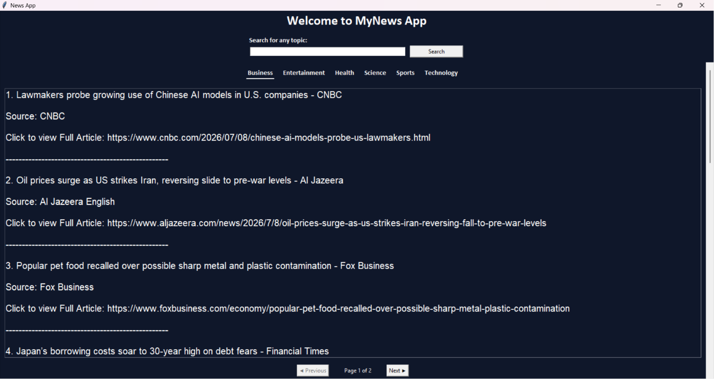

# 📰 MyNews App

A modern desktop news application built with **Python** and **Tkinter** that allows users to search for the latest news articles or browse top headlines by category using the **NewsAPI**.

---

## 📸 Screenshot



---

## ✨ Features

- 🔍 Search news by any keyword or topic
- 📰 Browse top headlines by category
- 📄 Pagination for easy navigation through articles
- 🌙 Clean and modern dark-themed interface
- 📌 Displays article title, source, and article link
- ⚡ Fast news fetching using the NewsAPI

---

## 📂 Available Categories

- Business
- Entertainment
- Health
- Science
- Sports
- Technology

---

## 🛠️ Built With

- Python
- Tkinter
- Requests
---

## 📁 Project Structure

```
News-App/
│
├── main.py
├── README.md
├── requirements.txt
├── .gitignore
├── .env.example
└── screenshot.png
```

---

## ⚙️ Installation

### 1. Clone the repository

```bash
git clone https://github.com/YOUR_USERNAME/NewsApp.git
```

### 2. Move into the project directory

```bash
cd NewsApp
```

### 3. Install the required packages

```bash
pip install -r requirements.txt
```

### 4. Get your NewsAPI key

Create a free account at:

https://newsapi.org

### 5. Create a `.env` file

Create a file named `.env` in the project folder.

Copy the contents of `.env.example`:

```env
NEWS_API_KEY=YOUR_API_KEY_HERE
```

Replace `YOUR_API_KEY_HERE` with your own NewsAPI key.

### 6. Run the application

```bash
python main.py
```

---

## 📖 How to Use

- Enter any topic in the search bar and click **Search**.
- Click on any category to view the latest headlines.
- Navigate through articles using the **Previous** and **Next** buttons.

---

## 🔒 Security

This project uses environment variables to keep API keys secure.

Your API key should be stored in a `.env` file, which is ignored by Git and is **not uploaded** to GitHub.

---


## ⭐ Support

If you found this project helpful, consider giving it a ⭐ on GitHub!
